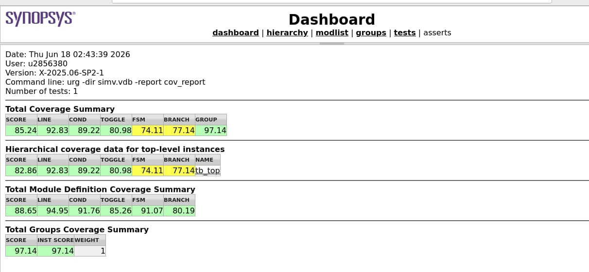
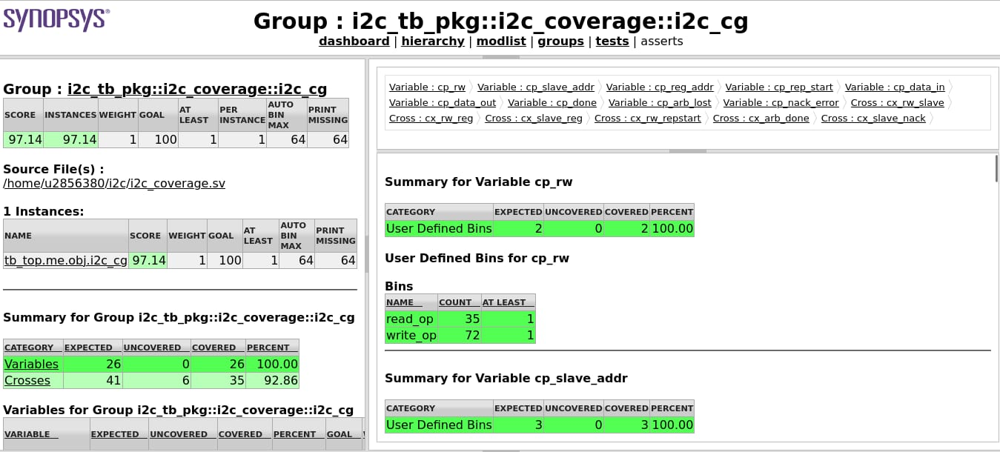
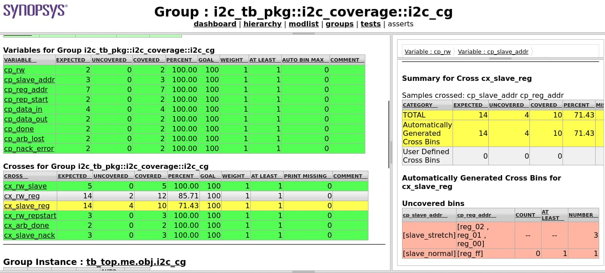
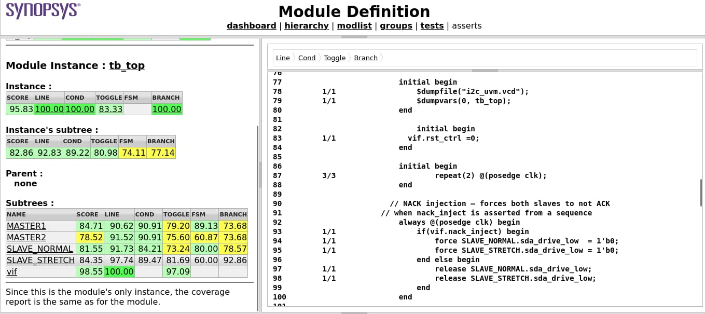
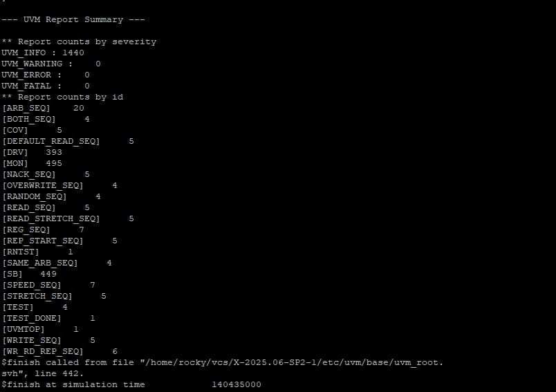

# UVM-Based Verification of I2C Master Controller

A complete UVM verification environment for an I2C Master Controller RTL design, developed and simulated using Synopsys VCS (X-2025.06-SP2-1).

---

## Architecture

```text
tb_top
├── i2c_if          (Interface)
└── i2c_env
    ├── i2c_master_agent (M1)
    │   ├── uvm_sequencer
    │   ├── i2c_master_driver
    │   └── i2c_master_monitor
    ├── i2c_master_agent (M2)
    │   ├── uvm_sequencer
    │   ├── i2c_master_driver
    │   └── i2c_master_monitor
    ├── i2c_scoreboard
    └── i2c_coverage
```

---

## DUT: I2C Master Controller

- Supports Standard (100 kHz), Fast (400 kHz), and Fast-Plus (1 MHz) speed modes via `speed_sel`
- Features: repeated start, clock stretching, NACK handling, multi-master arbitration

**Ports:**

| Port | Direction | Description |
|------|-----------|-------------|
| `clk`, `rst` | Input | Clock and reset |
| `start`, `rw` | Input | Transaction control |
| `addr[6:0]` | Input | Slave address |
| `reg_addr[7:0]` | Input | Register address |
| `data_in[7:0]` | Input | Write data |
| `speed_sel[1:0]` | Input | Speed mode select |
| `rep_start` | Input | Repeated start enable |
| `data_out[7:0]` | Output | Read data |
| `busy`, `done` | Output | Status flags |
| `nack_error`, `arb_lost` | Output | Error flags |
| `sda`, `scl` | Inout | I2C bus |

---

## Testbench Components

| File | Component | Description |
|------|-----------|-------------|
| `i2c_if.sv` | Interface | I2C bus signals + master port mappings |
| `i2c_seq_item.sv` | Sequence Item | Randomized transaction object |
| `i2c_sequences.sv` | Sequences | All test sequences (write, read, stretch, NACK, arbitration) |
| `i2c_master_driver.sv` | Driver | Drives DUT inputs via virtual interface |
| `i2c_master_monitor.sv` | Monitor | Observes and samples bus activity |
| `i2c_master_agent.sv` | Agent | Encapsulates sequencer + driver + monitor |
| `i2c_scoreboard.sv` | Scoreboard | Dual-port checker with reference memory model |
| `i2c_coverage.sv` | Coverage | Functional covergroups for all scenarios |
| `i2c_env.sv` | Environment | Top-level UVM env (dual-master) |
| `i2c_test.sv` | Tests | All test classes |
| `i2c_tb_pkg.sv` | Package | Imports and includes |
| `tb_top.sv` | TB Top | DUT instantiation + UVM run |

---

## Test Scenarios Verified

- ✅ Basic register write / read
- ✅ Repeated start condition
- ✅ Clock stretching (slave-initiated)
- ✅ NACK handling
- ✅ Multi-master arbitration
- ✅ Multiple speed modes (Standard / Fast / Fast-Plus)

---

## Coverage Results

| Metric | Result |
|--------|--------|
| Overall Score | **85.24%** |
| Line Coverage | **92.83%** |
| Condition Coverage | **89.22%** |
| Toggle Coverage | **80.98%** |
| FSM Coverage | **74.11%** |
| Branch Coverage | **77.14%** |
| Functional Coverage (Groups) | **97.14%** |
| Tool | Synopsys VCS X-2025.06-SP2-1 |

### Coverage Dashboard


### Functional Coverage — i2c_cg


### Cross Coverage Detail


### Code Coverage — Module Definition


---

## UVM Report Summary

- `UVM_INFO : 1440` | `UVM_WARNING : 0` | `UVM_ERROR : 0` | `UVM_FATAL : 0`
- Simulation end time: **241135000 ps**
- All sequences executed: WRITE, READ, REP_START, NACK, STRETCH, ARB, SPEED, RANDOM, OVERWRITE



---

## How to Run

```bash
cd sim/
chmod +x run.sh
./run.sh
```

Requires Synopsys VCS with UVM-1.2 library.

---

## Tools & Environment

- **Simulator:** Synopsys VCS X-2025.06-SP2-1
- **Methodology:** UVM 1.2
- **Language:** SystemVerilog (IEEE 1800-2012)
- **OS:** Linux
